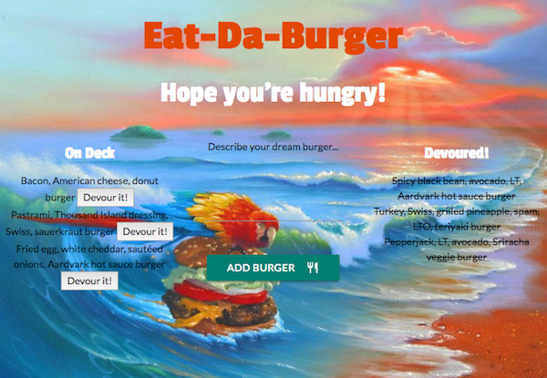

<h1 align="center">Eat-Da-Burger</h1>
A "restaurant app" that lets users input the names of burgers they'd like to eat, then devour each burger with a click of a button

## Technologies Used
* Node.js, Express, MySQL, Handlebars, Materialize CSS, and a homemade ORM!
* Uses MVC (Model, View, Controller) structure

### Deployed Link
[Heroku]https://limitless-temple-77629.herokuapp.com/

### Key Features
* User text inputs (burgers) are saved to a MySQL database
* Burgers saved to the database are persistent, "devoured" or not

### Screenshots

 
##### Background image by <a href="http://jimwarren.com/">Jim Warren</a>